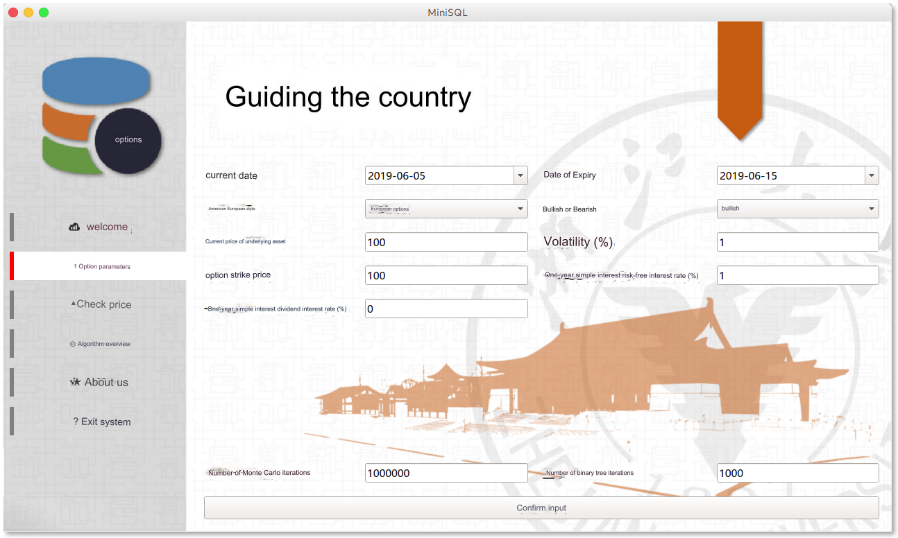

> For more exciting content, please visit [my blog](https://qsctech-sange.github.io), let’s have a good time together!

# Options Calculator

This is an all-in-one option calculator, covering the BS method, Monte Carlo method, and binary method. It can price call options, put options, European options, American options, options with dividends, and options without dividends, and comes with a GUI. client.

The **feature** of this calculator is that

1. Supports a very comprehensive range of option types
2. Beautiful, elegant, concise and generous interface
3. Use multi-threading to optimize user experience
4. You can directly extract and use the `Option` class to apply it where you need to calculate option prices.
5. You can specify a specific date without having to manually calculate the time interval.
6. You can directly enter the one-year risk-free interest rate without the user having to calculate continuous compound interest.

> The above two points directly bring Options Calculator from an ordinary academic research calculator to a universal and practical value level. extension at the breadth level.

7. You can compare and observe the differences in calculation results of different methods.
8. You can manually specify the number of iterations of the binary tree method and the Monte Carlo method to better understand option pricing.

> The above two points deepen the academic research value of Options Calculator. Depth level enhancements.


## Features


The main interface adopts the popular left-right layout. The left side is the LOGO and six Tab tab function pages, and the right side is the main interface corresponding to each tab page. The default is under the first Tab, which is Welcome. Since no parameters have been entered, the price cannot be viewed and the third tab is disabled.



In the input parameter interface, it covers the entry of some parameters related to options. The first is the current date. Today's date is set by default, and past dates can be specified. Clicking here will call a calendar format. The expiration date defaults to ten days after the current date. Then there are American European and Bullish or Bearish options, only two options are available. Finally, there is the input of the current price of the underlying asset, option exercise price, volatility, one-year simple interest risk-free interest rate, and one-year simple interest dividend interest rate. Some will be provided by default here in case users want to see the results directly. Volatility, risk-free interest rate, and dividend interest rate all end with %, that is, if the user wants to enter 5%, just enter 5. In other option calculators, users are often asked to directly enter the risk-free interest rate, but here we require users to enter the one-year simple interest rate, leaving the conversion to the calculator itself. Finally, you can specify the number of Monte Carlo iterations and the number of binary trees, or you can use the default settings.


After clicking to confirm the input, a prompt box will pop up to ask the user to wait, and after completion, it will automatically jump to the tab for viewing the price. The calculation results of three methods can be observed.


The algorithm overview is directly (tou) connected (lan) to the MBA web interface.


about Us.


Goodbye page.


## Compilation method

The project depends on `Python3` and the following Python packages: `numpy`, `pyqt5`, `qtawesome` and `scipy`.

After installing python, you can enter the project directory and install the missing packages through the following instructions.

```shell
pip install requirements.txt
```


1. Download this repository on [this page](<https://github.com/QSCTech-Sange/Options-Calculator>) and unzip it
2. Enter in the terminal

```shell
cd to the directory you just extracted
cd Frontend
chmod a+x main.py
python main.py
```

That’s it.

## Project structure

This project has a total of 621 lines and the structure is as follows:

```shell
.
├── Backend
│   ├── __init__.py
│   ├── Option.py
├── Frontend
│   ├── about.py
│   ├── img
│   │   ├── background_2.png
│   │   ├── background_3.png
│   │   ├── background.png
│   │   ├── hint.png
│   │   └── logo2.png
│   ├── input.py
│   ├── list.py
│   ├── main.py
│   ├── page.py
│   ├── quit.py
│   ├── result.py
│   ├── style.qss
│   └── welcome.py
├── img
│   ├── about.png
│   ├── input.png
│   ├── list.png
│   ├── quit.png
│   ├── result.png
│   └── welcome.png
├── README.md
└── requirements.txt

```

The project is divided into front-end and back-end. The front-end is in the `Frontend` folder and the back-end is in the `Backend` folder. `README.md` is this file. The files in `img` in the root directory are only for the rendering of this document, so just ignore them. `requirements.txt` records the project's dependencies.

### rear end

There are `__init__.py` and `option.py` in the backend. The former is just a file necessary for front-end import, and its content is empty.

`Option.py` is the core, with an `option` class containing option data and methods for calculating prices. It can be opened and read, with detailed comments. We need `numpy` to calculate the `ndarray` list and generate random numbers, and `scipy` to calculate the normal distribution distribution function. Built-in B-S algorithm, Monte Carlo algorithm and binary tree algorithm.

### front end

The front-end is based on the main framework of `Qt`. The main interface is in `main.py` and requires `qtawesome` to draw icons. `page.py` is the basis for a single page.

`welcome.py` `input.py` `result.py` `list.py` `about.py` `quit.py` correspond to the welcome page, input page, results page, algorithm overview page and exit page respectively. `style.qss` is the style, which defines some things such as which buttons should look like and so on. The files in img in this directory are some pictures needed to draw the interface.


## Detailed explanation of algorithm

```python
class Option:
  
    def __init__(self, european, kind, s0, k, t, r, sigma, dv):
        self.european = european
        self.kind = kind
        self.s0 = s0
        self.k = k
        self.t = t /365
        self.sigma = sigma
        self.r = r
        self.dv = dv
        self.bsprice = None
        self.mcprice = None
        self.btprice = None
```

It is considered here that the risk-free interest rate and dividend interest rate passed to the option's constructor are both annual interest rates, and we calculate them as continuous compound interest during construction.

### B-S-M calculation method

Because it involves dividend interest rates, strictly speaking it is not a BS algorithm but a BSM algorithm.

```python
    def bs(self):
        if self.european or self.kind == 1:
            d_1 = (np.log(self.s0 / self.k) + (
                    self.r - self.dv + .5 * self.sigma ** 2) * self.t) / self.sigma / np.sqrt(
                self.t)
            d_2 = d_1 - self.sigma * np.sqrt(self.t)
            self.bsprice = self.kind * self.s0 * np.exp(-self.dv * self.t) * sps.norm.cdf(
                self.kind * d_1) - self.kind * self.k * np.exp(-self.r * self.t) * sps.norm.cdf(self.kind * d_2)
        else:
            self.bsprice = "American put options are not suitable for this calculation method"
```

The BSM algorithm itself can only be used for **European options**. Since American call options and European call options are equal in price, we will extend it to only **Cannot calculate American put options**.

Among them we calculated d1 and d2 which are the intermediate variables used in the final calculation. When it comes to dividends, they are

$$
d_1 = \frac{ln\frac{S0}{k} + (r+ 0.5 \cdot \sigma^2 - dv)t}{\sigma \cdot \sqrt{t}}
$$

$$
d_2 = d_1 - \sigma \sqrt{t}
$$

And the price of a call option (involving dividends) is
$$
P = S_0 \cdot e^{-dv \cdot t} \cdot N(d_1) - k \cdot e^{-rt}N(d_2)
$$
The price of the put option is
$$
P = ke^{-rt}[1-N(d_2)] - S_0[1-N(d_1)]
$$
Some tricks are used here to express kind as a flag mark, so that the same formula can be applied to both bullish and bearish situations. Notice
$$
N(d) = 1 - N(-d)
$$
This is why our formula works correctly.


### Monte Carlo simulation calculation method

The Monte Carlo algorithm itself can only be used for **European options**. Since American call options and European call options are equal in price, we will extend it to only **Cannot calculate American put options**.

The Monte Carlo simulation calculation method requires specifying the number of iterations.

Note that the `zt` we generated is a list, not a single value. The distribution of all its values ​​conforms to a standard normal distribution. There are a total of iteration values, which represent the rise or fall of the fluctuation.

Next, we use this formula
$$
st = s0 * e^{(r-dv-0.5*\sigma^2)*t + \sigma *t ^{0.05}*zt}
$$
To calculate the final value, here a final value of the number of iterations is generated based on the number of iterations. These final values ​​are processed by k- x or x-k depending on whether they are bullish or bearish, and the larger value compared to 0 is taken.

We calculate the average of these final values ​​and discount them to the current date. Discount refers to the original value multiplied by e^(-r*t)

```python
    # Monte Carlo Pricing
    def mc(self, iteration):
        if self.european or self.kind == 1:
            zt = np.random.normal(0, 1, iteration)
            st = self.s0 * np.exp((self.r - self.dv - .5 * self.sigma ** 2) * self.t + self.sigma * self.t ** .5 * zt)
            st = np.maximum(self.kind * (st - self.k), 0)
            self.mcprice = np.average(st) * np.exp(-self.r * self.t)
        else:
            self.mcprice = "American put options are not suitable for this calculation method"
```

### Binary tree calculation method

This method is the most difficult, but applies to all options and is therefore the most necessary. We first need to calculate u, d, p. u represents an increase, d represents a decrease, and p is a risk-neutral probability. Each period may rise or fall, and u and d measure the multiple of the increase if it rises and the multiple of the fall if it falls. p is the probability of rising, and 1-p is the probability of falling. Starting from a single starting point (the value of the underlying asset) and slowly pushing it forward into the future, it may rise or fall, and then it may rise or fall again, thus slowly forming a binary tree. At this time, the price of the binary tree is not the option value, but the estimated current price in the future. What we need is the option price.

We need to deduce the option value from the leaf nodes of the tree from back to front. For example, the option value of the top node in the last step is equal to (n = number of iterations). Each node is similar, except that the following nodes need to replace u with d, and n decreases with an equal difference of 2 for each node.
$$
max(0,k-s_0u^n)
$$
This is a put option and a call option is
$$
max(0,s_0u^n-k)
$$
In this way we get all the option values ​​of the leaf nodes at the last level of the binary tree.

The process of pushing forward every time is like this,

The option value of node n-1 is equal to the value of the risk-neutral probability weighted and risk-free interest rate discount of the two nodes corresponding to n steps (the value of American simultaneous and early exercise is the larger value).

For example, the parent node of s0 u^500 and s0 u^498 is s0 u^499, and its option value is equal to

p *(option value of node 500) * (1-p) *(option value of node 499) × risk-free interest rate discount

The risk-free interest rate discount is e^(-rt)

Note that if it is an American option, this value must be compared with k - s0 u^499 (call is s0 u^499 - k), whichever is larger.

By pushing forward layer by layer, we arrive at our root node, which is the option value at this moment.

```python
    def bt(self, iteration):
        if iteration % 2 != 0:
            iteration += 1
        delta = self.t / iteration
        u = np.exp(self.sigma * np.sqrt(delta))
        d = 1 / u
        p = (np.exp((self.r - self.dv) * delta) - d) / (u - d)
        tree = []
        for j in range(int(iteration / 2) + 1):
            i = j * 2
            temp = self.s0 * np.power(u, iteration - i)
            temp = np.max([(temp - self.k) * self.kind, 0])
            tree.append(temp)
        for j in range(1, int(iteration / 2) + 1):
            i = j * 2
            temp = self.s0 * np.power(d, i)
            temp = np.max([(temp - self.k) * self.kind, 0])
            tree.append(temp)
        for j in range(0, iteration):
            newtree = []
            for i in (range(len(tree) - 1)):
                temp = tree[i] * p + (1 - p) * tree[i + 1]
                temp = temp * np.exp(-self.r * delta)
                if not self.european:
                    # 每一层的最高幂次
                    k = iteration - j - 1
                    if i < (k + 1) / 2:
                        power = k - i * 2
                        compare = self.s0 * np.power(u, power)
                    else:
                        power = i * 2 - k
                        compare = self.s0 * np.power(d, power)
                    temp = np.max([temp, (compare - self.k) * self.kind])
                newtree.append(temp)
            tree = newtree
        self.btprice = tree[0]
```

